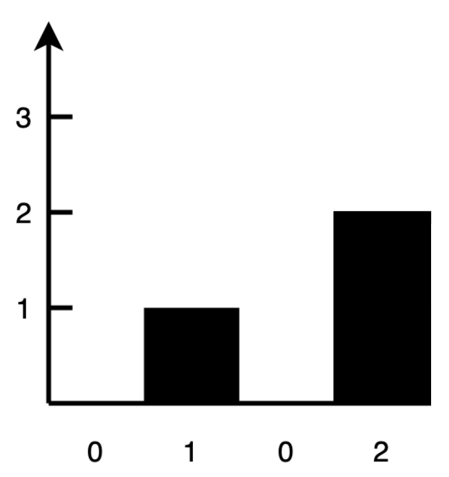
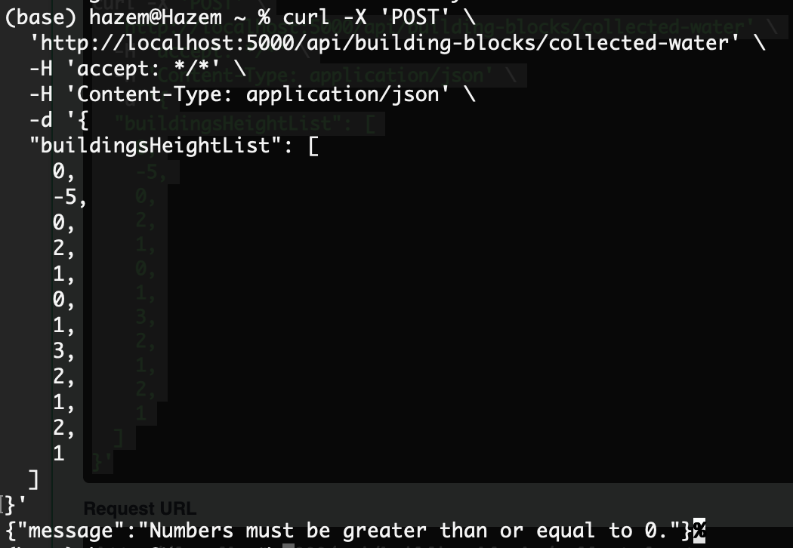

<div id="top"></div>
<!--
*** Thanks for checking out the Best-README-Template. If you have a suggestion
*** that would make this better, please fork the repo and create a pull request
*** or simply open an issue with the tag "enhancement".
*** Don't forget to give the project a star!
*** Thanks again! Now go create something AMAZING! :D
-->


<!-- PROJECT SHIELDS -->
<!--
*** I'm using markdown "reference style" links for readability.
*** Reference links are enclosed in brackets [ ] instead of parentheses ( ).
*** See the bottom of this document for the declaration of the reference variables
*** for contributors-url, forks-url, etc. This is an optional, concise syntax you may use.
*** https://www.markdownguide.org/basic-syntax/#reference-style-links
-->
[![Contributors][contributors-shield]][contributors-url]
[![Forks][forks-shield]][forks-url]
[![Stargazers][stars-shield]][stars-url]
[![Issues][issues-shield]][issues-url]
[![LinkedIn][linkedin-shield]][linkedin-url]


<!-- PROJECT LOGO -->
<br />
<div align="center">
  <a href="https://github.com/hazembenhassine/test_node">
    
  </a>

<h3 align="center">TRAPPED WATER PROBLEM</h3>

  <p align="center">
    Trapped water problem, solved on Node.js and exposed on a RESTful API.
    <br />
    <a href="https://github.com/hazembenhassine/test_node"><strong>Explore the docs »</strong></a>
    <br />
    <br />
    <a href="https://building-blocks-water.herokuapp.com/api-docs/">View Demo</a>
  </p>
</div>


<!-- TABLE OF CONTENTS -->
<details>
  <summary>Table of Contents</summary>
  <ol>
    <li>
      <a href="#about-the-project">About The Project</a>
      <ul>
        <li><a href="#built-with">Built With</a></li>
      </ul>
    </li>
    <li>
      <a href="#getting-started">Getting Started</a>
      <ul>
        <li><a href="#using-docker">Using Docker</a></li>
        <li><a href="#using-npm">Using npm</a></li>
      </ul>
    </li>
    <li><a href="#usage">Usage</a></li>
    <li>
	    <a href="#examples">Examples</a>
		<ul>
	        <li><a href="#simple-cases">Using Docker</a></li>
	        <li><a href="#using-npm">Using npm</a></li>
		</ul>
    </li>
    <li>
        <a href="#how-it-works">How it works</a>
        <ul>
	        <li><a href="#how-to-solve-the-problem">How to solve the problem</a></li>
	        <li><a href="#how-to-optimize-it">How to optimize it</a></li>
		</ul>
    </li>
    <li><a href="#contact">Contact</a></li>
  </ol>
</details>


<!-- ABOUT THE PROJECT -->
## About The Project

Living in a 2d world comes with quite a few problems. Turns out that stacking buildings in a 2d world, causes rainwater to be trapped between buildings. This project aims to help the architects of the 2d world better design their blocks. It takes in building heights, and calculates how much rainwater can be trapped between its buildings.

<p align="right">(<a href="#top">back to top</a>)</p>


### Built With

* [Node.js](https://nodejs.org/)
* [Express](https://expressjs.com/)

<p align="right">(<a href="#top">back to top</a>)</p>


<!-- GETTING STARTED -->
## Getting Started

Running this project is fairly easy, we propose two methods of running this project instantly.

### Using Docker

#### Prerequisites

* Docker:
   Install Docker at https://docs.docker.com/get-docker/   

#### Installation

1. Clone the repo
   ```sh
   git clone https://github.com/hazembenhassine/test_node.git
   ```
2. Make sure that port 5000 is free on your localhost
3. Run Docker Compose
   ```sh
   docker-compose up
   ```

### Using npm

#### Prerequisites

* Node.js:
   Get Node.js at https://nodejs.org/en/download/

#### Installation

1. Clone the repo
   ```sh
   git clone https://github.com/hazembenhassine/test_node.git
   ```
2. Install dependencies
   ```sh
   npm install
   ```
4. Make sure that port 5000 is free on your localhost
5. Start the project
   ```sh
   npm run dev
   ```

<p align="right">(<a href="#top">back to top</a>)</p>

<!-- USAGE EXAMPLES -->
## Usage

This project has one single ```POST``` end point which is ```/api/building-blocks/collected-water```.
It takes an array of integers as an input, and returns a single integer representing the value of trapped water.

```bash
curl -X 'POST' \
  'http://localhost:5000/api/building-blocks/collected-water' \
  -H 'accept: */*' \
  -H 'Content-Type: application/json' \
  -d '{
  "buildingsHeightList": [
    0,
    1,
    0,
    2,
    1,
    0,
    1,
    3,
    2,
    1,
    2,
    1
  ]
}'
```

## Examples

### Simple Cases:

1. Case 1:
    Preview:
    <div>
        
    </div>
    Result:
    <div>
        
    </div>
2. Case 2:
    Preview:
    <div>
        
    </div>
    Result:
    <div>
        
    </div>
3. Case 3:
    Preview:
    <div>
        
    </div>
    Result:
    <div>
        
    </div>
 
### Complex Cases:
1. Case 1:
    Preview:
    <div>
        
    </div>
    Result:
    <div>
        
    </div>
2. Case 2:
    Preview:
    <div>
        
    </div>
    Result:
    <div>
        
    </div>
    
### Edge Cases:
1. Case 1:
    Submitting a list that contains one negative number.
    Result:
    <div>
        
    </div>

<p align="right">(<a href="#top">back to top</a>)</p>

<!-- HOW IT WORKS -->
## How it works

### How to solve the problem

1. For every building, we need to locate the highest building on its left and its right.
    <div>
        
    </div>

2. Find the minimum between the highest buildings on the left and right.
    <div>
        
    </div>

3. Water level is the difference between the result of the last step and the height of the current building.

4. Increment total

5. Rince and repeat for the remaining buildings.

Solving the problem in this manner gives us a complexity of O(n^2).


### How to optimize it

1. Begin by finding the highest building in the list.

    
2. Slice original list into two smaller lists at the index of the highest building.
3. Iterate left list starting from the left, keeping track of the maximum on the left as you go.
    No need to find the highest building on the right, since the highest on the right is the highest building of the original list.
    
4. Water level is the difference between the highest building on the left and the height of current building.
5. Increment total
6. Repeat steps 3, 4 and 5 for the list on the right but by iterating through the list from the right
    

Using this approach, we get a complexity of O(n).


<p align="right">(<a href="#top">back to top</a>)</p>

<!-- CONTACT -->
## Contact

BEN HASSINE Mohamed Hazem - mohamedhazem.benhassine@insat.ucar.tn

Project Link: [https://github.com/hazembenhassine/test_node](https://github.com/hazembenhassine/test_node)

<p align="right">(<a href="#top">back to top</a>)</p>


<!-- MARKDOWN LINKS & IMAGES -->
<!-- https://www.markdownguide.org/basic-syntax/#reference-style-links -->
[contributors-shield]: https://img.shields.io/github/contributors/hazembenhassine/test_node.svg?style=for-the-badge
[contributors-url]: https://github.com/hazembenhassine/test_node/graphs/contributors
[forks-shield]: https://img.shields.io/github/forks/hazembenhassine/test_node.svg?style=for-the-badge
[forks-url]: https://github.com/hazembenhassine/test_node/network/members
[stars-shield]: https://img.shields.io/github/stars/hazembenhassine/test_node.svg?style=for-the-badge
[stars-url]: https://github.com/hazembenhassine/test_node/stargazers
[issues-shield]: https://img.shields.io/github/issues/hazembenhassine/test_node.svg?style=for-the-badge
[issues-url]: https://github.com/hazembenhassine/test_node/issues
[license-shield]: https://img.shields.io/github/license/hazembenhassine/test_node.svg?style=for-the-badge
[license-url]: https://github.com/hazembenhassine/test_node/blob/master/LICENSE.txt
[linkedin-shield]: https://img.shields.io/badge/-LinkedIn-black.svg?style=for-the-badge&logo=linkedin&colorB=555
[linkedin-url]: https://www.linkedin.com/in/hazem-benhassine/